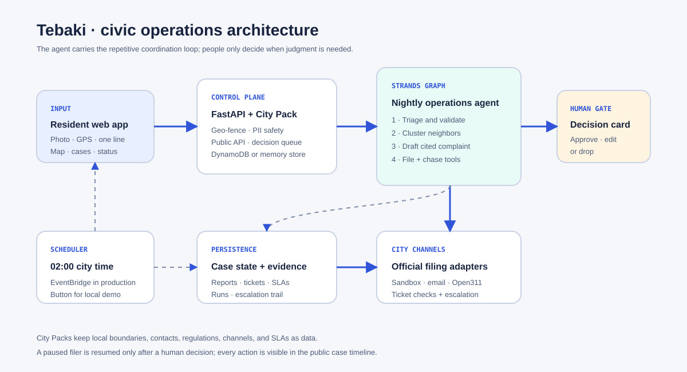

# Tebaki (ጠባቂ) — The City's Guardian

> Every civic app makes the citizen do the follow-up. **Tebaki makes the government do the follow-up.**

Residents report an issue once. A Strands guardian triages it immediately, then the supervised nightly graph clusters nearby reports, drafts an evidence-backed complaint citing the city's regulations, prepares a filing through the configured city channel, tracks the case against SLA clocks, and escalates stale cases up the official ladder. The only external action is gated by a human decision card. Channels are explicitly labelled as real, simulated, or dry-run in the case dossier and proof screen.

**Built for the Agents for Humans Hackathon (Good Neighbor Agents track).**

## Repo layout

```
tebaki/
├─ engine/           Python: Strands orchestrator, FastAPI, tools, agents
├─ web/              React 19 + Vite + TS SPA/PWA (intake, map, evidence, impact + replay)
├─ cities/           City Packs: addis.yaml, chicago.yaml, sandbox.yaml (+ geojson/)
├─ infra/            Container + AgentCore deployment helper
├─ sandbox-portal/   Mock city portal for offline dev/CI/eval
├─ cli/              tebaki validate / run / demo / chase
└─ tebaki.md         Full plan (pitch, architecture, schedule)
```

For a concise judge-facing overview, see [`docs/submission-brief.md`](docs/submission-brief.md).

## Quickstart

The production city pack is Addis Ababa. For a repeatable local demo and CI, start the sandbox pack:

```bash
# 1. mock city complaint portal (terminal 1)
cd sandbox-portal && ../.venv/bin/uvicorn portal.app:app --port 9100

# 2. Tebaki engine API (terminal 2, repo root)
TEBAKI_CITY_PACK=sandbox PYTHONPATH=engine:sandbox-portal .venv/bin/uvicorn app.api.main:app --port 8000

# 3. web app (terminal 3)
cd web && npm install && npm run dev   # http://localhost:5173
```

Try it: submit a report at `/report`, then hit **Process new reports** on the dashboard (or `curl -X POST localhost:8000/admin/nightly -H 'Content-Type: application/json' -d '{"auto_approve": false}'`). The draft appears under **Review** — approve it and the guardian files it with the mock portal and returns a real ticket id.

For a judge-ready seeded path, use the sandbox pack above and choose **Load sample reports**. It inserts two nearby waste reports from different neighbors plus one separate pothole. The visible flow is: **Load sample reports → Process new reports → Review → approve → ticket → Demo: miss SLA → Check deadlines**. The demo clock control is sandbox-only, idempotent for active tickets, and lets the chaser prove escalation without waiting several days.

## Architecture



The deployed shape is a Strands workflow on AgentCore Runtime backed by DynamoDB, Bedrock, and the configured city channel. Local development uses the same graph, a scripted offline model, an in-memory store, and the sandbox portal. The human approval interrupt is durable in the persistent store and every run emits an activity trail for the dashboard.

The operator UI makes the agent accountable: each case has a lifecycle timeline and evidence drawer, while **Replay** replays a persisted run and **Impact** presents anonymized neighborhood outcomes. The browser-safe production contract is `Browser → API proxy → AgentCore → DynamoDB/Bedrock/channels`; the browser never signs AWS requests. AgentCore also accepts the same REST operations through its `/invocations` HTTP-style envelope for proxy deployments.

Live endpoints (us-east-1): [HTTPS web demo](https://d20081fyuc7fwc.cloudfront.net/) · [public API](https://pxgwrenfrk.execute-api.us-east-1.amazonaws.com/health). The web build is served through CloudFront; the API proxy keeps AWS signing and operator credentials server-side. Addis has a verified Bole sub-city pilot polygon with city-level fallback elsewhere. Gmail SMTP is configured for real delivery only after explicit human approval.

For persistence, run DynamoDB Local (`docker run -d -p 8000:8000 amazon/dynamodb-local:latest` — use a port other than 8000 if the engine owns 8000) and start the engine with `TEBAKI_STORE=dynamodb TEBAKI_DDB_ENDPOINT=<url> TEBAKI_DYNAMODB_TABLE=tebaki`.

For a live Bedrock run: set `TEBAKI_LIVE_BEDROCK=1` on the engine (requires AWS credentials with Nova access). For real email filing, configure Gmail SMTP with an app password in Secrets Manager, or use SES with a verified sender. Both paths remain blocked until a human approves a decision card.

### Browser-safe AgentCore proxy

`infra/proxy_lambda.py` is the thin API Gateway/Lambda bridge for a hosted web build. It signs requests with the Lambda role, forwards the existing REST contract as an AgentCore HTTP envelope, and keeps operator mutations behind a bearer token. Deploy it with `infra/template.yaml` after storing the runtime ARN, web origin, and operator token in SSM/Secrets Manager; set the resulting API URL as `VITE_API_URL` when building the web app.

The same template provisions an EventBridge-triggered nightly Lambda. It invokes `/admin/nightly` at 02:00 Africa/Addis_Ababa with human approval required; no browser token is used by the scheduler.

CLI: `.venv/bin/python cli/tebaki.py [validate|run|demo|chase] --city sandbox`.

### Camera-ready release checks

The live walkthrough and acceptance criteria are documented in [`docs/demo-runbook.md`](docs/demo-runbook.md). On Python 3.14, the known Strands sync-bridge/TestClient compatibility suite is isolated with the `python314_runtime` marker so the default release check remains finite:

```bash
PYTHONPATH=engine .venv/bin/python -m pytest engine/tests -q -p no:cacheprovider
```

That command runs the compatible checks and reports the isolated skips. Run the complete runtime-loop suite with Python 3.12, or deliberately opt in on 3.14 with `TEBAKI_RUN_PY314_RUNTIME=1`.

### Environment variables

| Variable | Purpose |
|---|---|
| `VITE_API_URL` | Web app: engine API base URL (default `http://localhost:8000`) — set at build time for a deployed engine |
| `TEBAKI_STORE` | `dynamodb` to use the DynamoDB store (default: in-memory) |
| `TEBAKI_DDB_ENDPOINT` / `TEBAKI_DYNAMODB_TABLE` | DynamoDB endpoint (Local) / table name |
| `TEBAKI_LIVE_BEDROCK` | `1` to run agents on Bedrock (default: scripted offline model) |
| `TEBAKI_BEDROCK_MODEL_ID` | Live model override; defaults to cost-conscious `amazon.nova-lite-v1:0` (Nova Micro/Pro are supported) |
| `TEBAKI_EMAIL_MODE` / `TEBAKI_SES_FROM` | `ses` + verified sender to send email filings for real |
| `TEBAKI_SMTP_HOST` / `TEBAKI_SMTP_FROM` / `TEBAKI_SMTP_SECRET_ARN` | Optional Gmail SMTP demo path; store `username` and Gmail app `password` in Secrets Manager |
| `TEBAKI_SANDBOX_PORTAL_URL` | Sandbox filing portal base URL (default `http://localhost:9100`; useful when deployed separately) |
| `TEBAKI_CHICAGO_311_KEY` | Chicago Open311 API key |
| `TEBAKI_CORS_ORIGINS` | Allowed CORS origins for the engine (JSON list) |

### Public-repository safety

Runtime credentials are deliberately external to the repository. Local
`engine/.env` and `web/.env.*` files are ignored, SMTP credentials live in
Secrets Manager, and the Docker build excludes environment files and key
material. Before publishing, confirm that `git status --short` does not list a
local environment file and never use `git add -f` on one.

### Accountability API

The public read surfaces are intentionally safe to expose to a resident-facing web app:

| Endpoint | Purpose |
|---|---|
| `/public/reports/{id}/timeline` | Report lifecycle from submission through filing/escalation |
| `/public/complaints/{id}` | Case dossier, source reports, evidence, citation, and timeline |
| `/public/runs` and `/public/runs/{id}` | Replayable agent runs and summarized tool activity |
| `/public/impact` | Aggregated neighborhood outcomes and SLA attention |
| `/public/proof` | Runtime, persistence, model, and workflow verification counters |

### Camera-ready truth table

| Capability | Current status | Boundary shown to judges |
|---|---|---|
| Agent workflow | Live Strands triage, cluster, drafter, filer, coordinator, and chaser agents | Every run records agent, inputs, outputs, and resulting action |
| Human control | Live durable approve / edit / drop interrupt | No external filing occurs without an operator decision |
| Addis geography | Verified Bole sub-city polygon plus city-level fallback | Coverage is labelled partial; the full sub-city layer is not claimed |
| Addis delivery | Gmail SMTP configured in the deployed runtime | Real delivery is only performed after explicit approval |
| Deterministic demo | Sandbox portal with controllable SLA clock | Used for repeatable escalation recording; never presented as a city filing |
| Production persistence | DynamoDB | Reports, decision cards, complaints, and run history survive restarts |

## Adding a city

Any city is a pull request: copy `cities/sandbox.yaml`, fill in boundary GeoJSON, channels (email / Open311 API / web form), regulations, and SLAs, then `.venv/bin/python cli/tebaki.py validate cities/<name>.yaml --strict`.

## License

MIT
